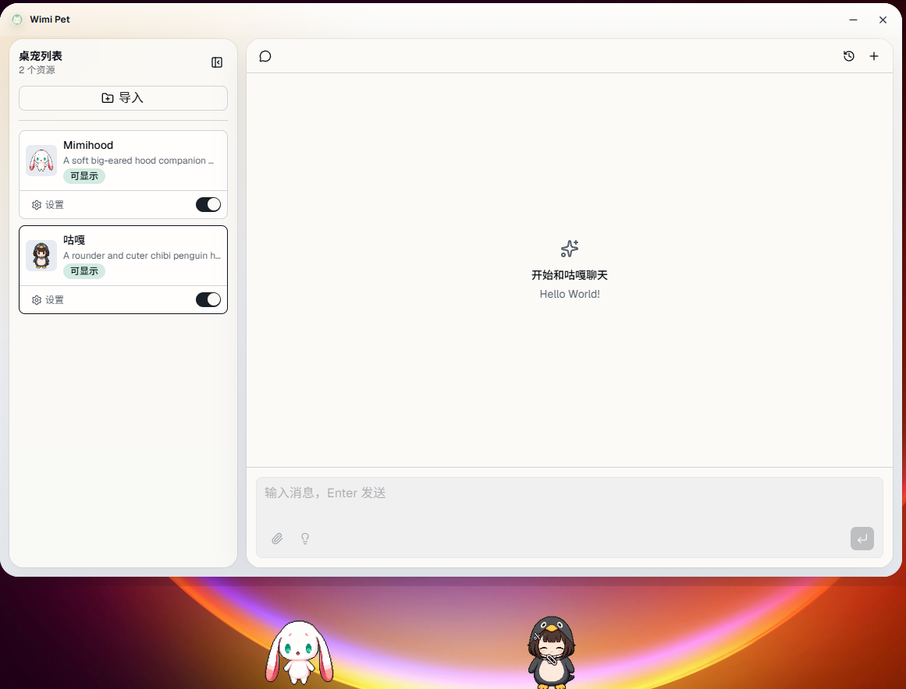
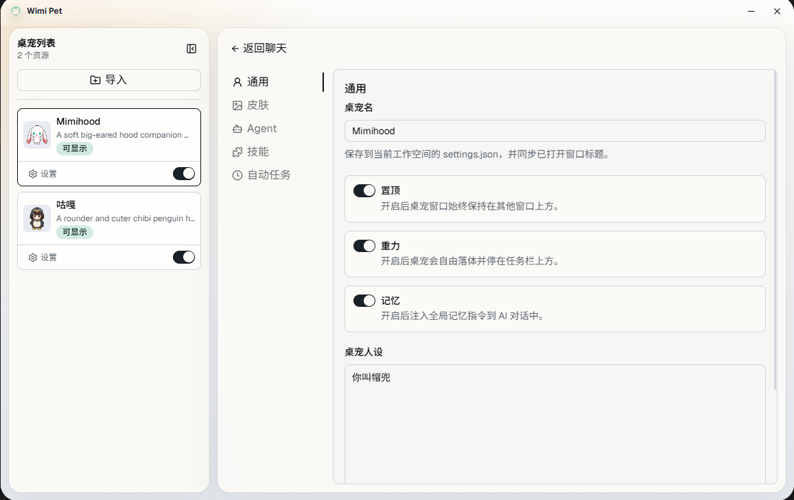

<div align="center">

<picture>
  
</picture>

# Wimi Pet

**Let AI live on your desktop.**  
A local AI desktop pet agent that can accompany, remember, and invoke tools.

<p>
  <a href="./README.md">中文</a>
  ·
  <a href="#quick-start">Quick Start</a>
  ·
  <a href="#workspace">Workspace</a>
  ·
  <a href="#built-in-skills">Built-in Skills</a>
</p>

<p>
  
  
  
  
  
</p>

</div>

---

## Preview

<p align="center">
  
  
</p>

## Features

| Feature | Description |
| --- | --- |
| 🐾 **Multi-Pet Parallel** | Run multiple pets simultaneously, each with independent windows, animations, skills, and memory. |
| 🤖 **AI Agent Pet** | Built on Pi Agent, supporting streaming output, tool invocation, and file attachment drag-and-drop. |
| 🧠 **Persistent Memory System** | Each pet has its own memory, remembering preferences, conversation history, and work habits. |
| ✨ **9 Animation States** | Supports idle, running, waving, jumping, failed, waiting, and more states. |
| 🍅 **Productivity Tools** | Built-in Pomodoro timer, todo list, and countdown, perfect for lightweight daily companionship. |
| ⏰ **Scheduled Tasks** | Automatically execute AI tasks daily, weekly, or at fixed intervals — hands-free automation. |
| 📦 **Codex Pets Compatible** | Supports importing [Codex Pets](https://codex-pets.net/) format resources directly. |

> Currently primarily supports **Windows**. macOS / Linux support is planned.

## Tech Stack

| Module | Technology |
| --- | --- |
| Frontend | TypeScript · React · Vite · Tailwind CSS · shadcn/ui |
| Desktop | Tauri 2 · Rust |
| Rendering | Canvas 2D Sprite Animation |
| AI | Pi Agent SDK · Node.js Runner |
| Extension | Skills · Workspace Config · Local Runtime Data |

## Quick Start

```bash
npm install
npm run tauri dev
```

Frontend only:

```bash
npm run dev
```

Build application:

```bash
npm run tauri build
```

## Workspace

Each pet folder is an independent workspace containing pet resources, AI configuration, and runtime data.

```text
my-pet/
├── SOUL.md                # Pet persona
├── pet.json               # Pet manifest file
├── spritesheet.png        # Spritesheet: 8 columns x 9 rows, each cell 192x208px
└── .wimipet/
    ├── settings.json      # AI settings: model, persona, skill config
    ├── memory/            # Memory
    ├── sessions/          # Conversation session metadata
    └── logs/              # AI runtime logs
```

### Workspace Features

- Each pet can be independently enabled / disabled
- Each pet has its own AI configuration and session data
- Automatically switch context when switching pets
- Import pet folders through the application interface

## Built-in Skills

<a href="./skills">Directory Link</a>

| Skill | Description |
| --- | --- |
| `pomodoro` | Pomodoro timer supporting start, pause, resume, and stop, with daily completion tracking. |
| `todolist` | Todo list management supporting add, complete, update, and delete tasks. |
| `countdown` | Countdown tool for important event reminders. |

## Custom Skills

Copy skill folders containing `SKILL.md` to either of the following locations:

| Type | Path | Scope |
| --- | --- | --- |
| Global Skills | `C:\Users\<username>\.wimipet\skills\` | Available to all pets |
| Local Skills | `<Pet Workspace>/.wimipet/skills/` | Only available to current pet |

## License

[GPL-3.0](LICENSE)
